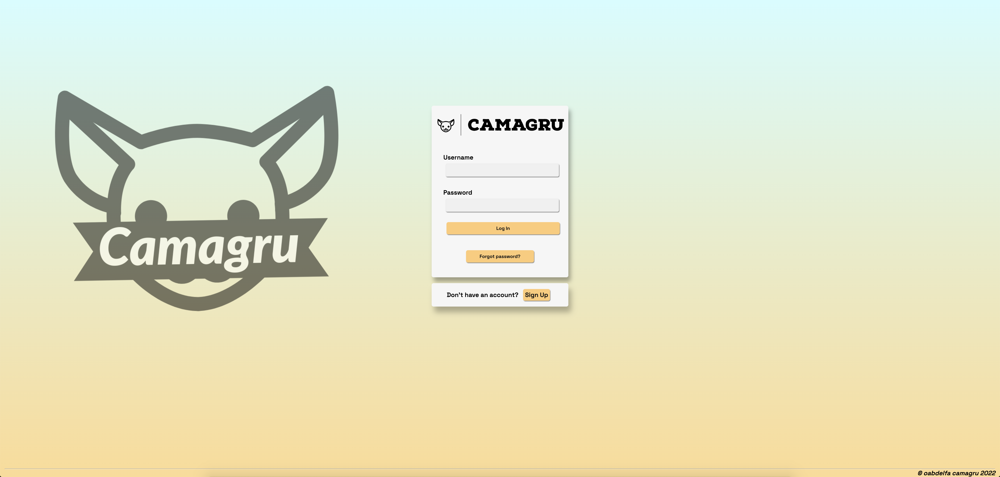
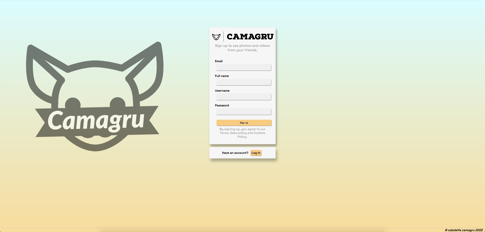
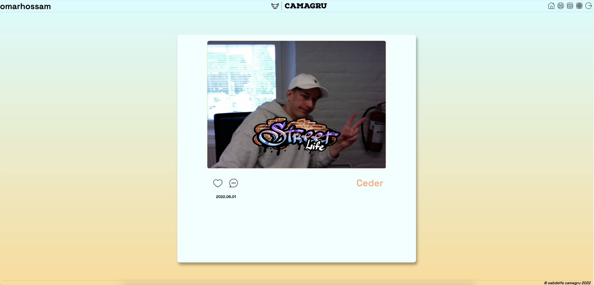
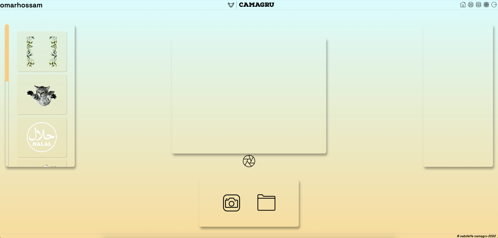
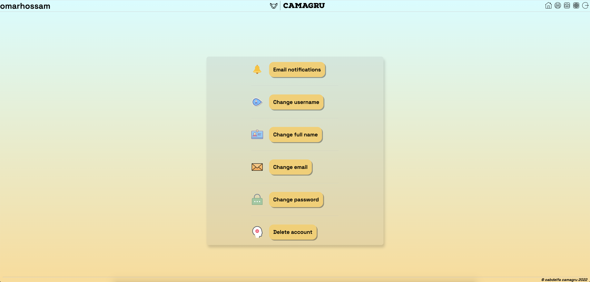

# Camagru 

Camagru/Hive Helsinki


## :diamond_shape_with_a_dot_inside: **Project's goal:**

This project is about creating an instagram-like site that enables users to make and share photo edits.

With the constraints of using PHP language only on the server-side, and HTML, CSS & JavaScript on the client-side 

without any frameworks, except for CSS frameworks that do not use any JavaScript.

## :page_with_curl: **How it's done:** 
- User start with signing up.
- The user info entries are verified and saved into **verification database** with a verification **code** generated.
- The code is sent by email to the user's email.
- The user enters the code to verify their account.
- If verification is correct, the user's info saved inside **user** table.
- User password is hashed before saving with a certain method.
- The user forwarded to signin then to **home page**.
- In **Picture Editing** page, the user can either use their webcam to capture a picture, or can upload one from local images.
- For **webcam pictures**, the user have to select a filter so they can capture the image, but this is not mandatory for uploads.
- Once the user capture the image, it's done by converting the ```div``` into an ```image url``` then sent to the server to be<br>
converted to an image.
- On the server side, the image alongside the filter selected gets processed with **PHP GD Image Functions** to create the final result image. 
- Finally it's stored into **images database** with ```BLOB``` format.
- The user **profile-page** will fetch automatically all the user's images from the database.

## :high_brightness: **The Web Pages**
➡️ **Landing Page:**


➡️ **Signin Page:**



➡️ **Signup Page:**



➡️ **Home Page:**



➡️ **Profile Page:**


➡️ **Editing Page With Camera:**



➡️ **Editing Page With Uploads:**


➡️ **Settings Page:**


